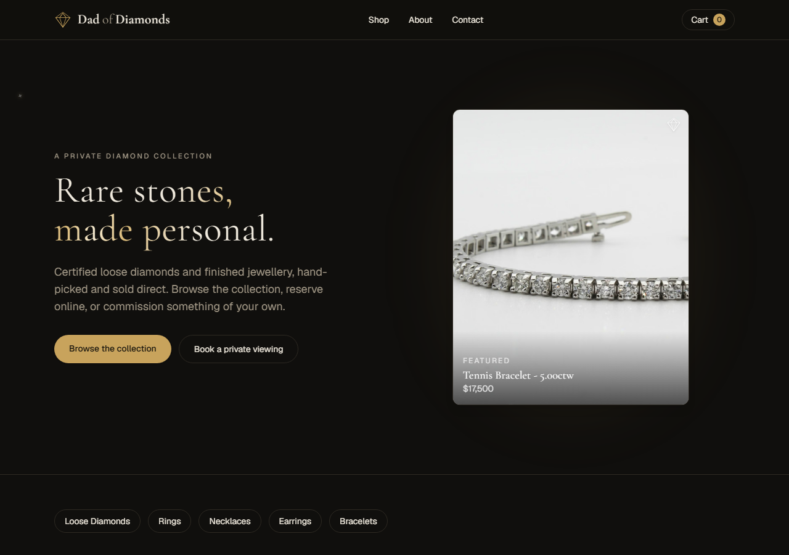
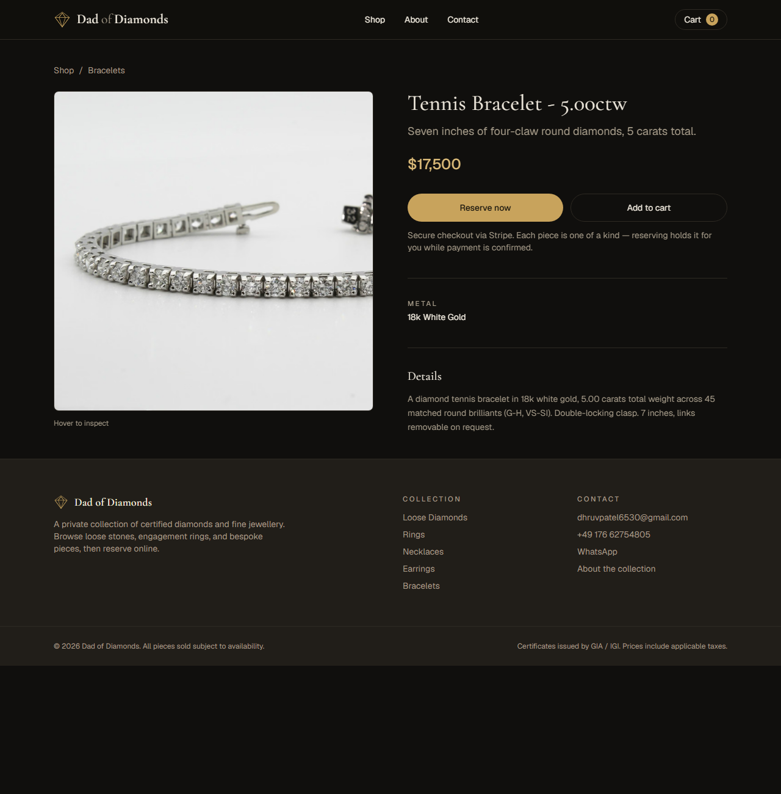
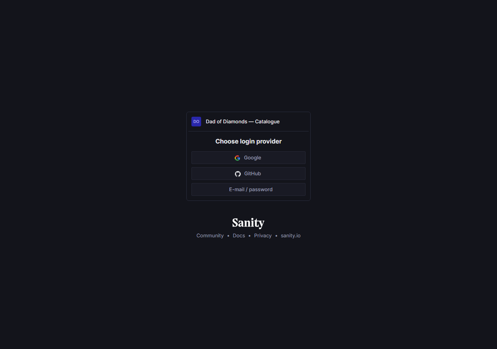

# Dad of Diamonds

A storefront for a private collection of certified diamonds and fine
jewellery — built with **Next.js 16**, **React 19**, **Tailwind CSS 4**,
**Sanity** (CMS), **Stripe** (payments) and **Resend** (enquiries).

**Live site:** https://dad-of-diamonds.vercel.app
**Admin (CMS):** https://dad-of-diamonds.vercel.app/studio



---

## What's in the box

- **Full storefront** — home, shop (filterable by category), product detail,
  cart, about, contact. Every piece is one of a kind: available / reserved /
  sold.
- **A real CMS** (Sanity, embedded at `/studio`) — add, edit and photograph
  pieces from a dashboard, no code. Falls back to sample data until it's
  connected, so the site is never broken.
- **Real checkout** (Stripe) — the cart creates a hosted Stripe Checkout
  session and re-prices everything server-side. Falls back to an email /
  WhatsApp enquiry until Stripe is configured.
- **Reliable enquiries** (Resend) — the contact form and "Send enquiry" email
  the shop owner directly, reply-to set to the customer, with honeypot +
  timing spam protection. Falls back to opening the visitor's own email app
  if it isn't configured.
- **A luxury motion layer, built with plain CSS** — scroll reveals, a
  cursor-tracking "jeweler's loupe" on product photos, twinkling sparkles, a
  gold light sweep across the headline, hover lifts. No animation library;
  everything respects `prefers-reduced-motion`.
- **SEO basics** — sitemap, robots.txt, per-page metadata, Open Graph tags.

|                                         Shop                                          |                                       Product page                                        |
| :-------------------------------------------------------------------------------------: | :------------------------------------------------------------------------------------: |
|  |  |

|                                           Admin (Sanity Studio)                                            |
| :----------------------------------------------------------------------------------------------------: |
|  |

---

## Run it locally

```bash
npm install
npm run dev
```

Open <http://localhost:3000>. It works immediately with **zero configuration**
— the catalogue comes from `src/lib/sample-products.ts`, checkout falls back
to an enquiry, and the enquiry form falls back to opening your email app.
Nothing is required to start developing.

### Environment variables

Copy `.env.example` to `.env.local` and fill in what you have — **every one of
them is optional**; each feature degrades gracefully without it (see the
setup guides below for each).

| Variable | For | Vercel type |
| --- | --- | --- |
| `NEXT_PUBLIC_SITE_URL` | Absolute URLs — SEO tags, Stripe redirects | Config |
| `NEXT_PUBLIC_SANITY_PROJECT_ID` / `NEXT_PUBLIC_SANITY_DATASET` | The CMS (catalogue + `/studio`) | Config |
| `SANITY_API_WRITE_TOKEN` | One-time: `npm run seed` only, never deployed | — (local only) |
| `STRIPE_SECRET_KEY` | Real payments | **Secret** |
| `STRIPE_WEBHOOK_SECRET` | Auto-marking items sold (optional, not yet wired up) | **Secret** |
| `RESEND_API_KEY` | Enquiry emails | **Secret** |
| `RESEND_FROM` | Custom sender once a domain is verified in Resend | Config |

> **Vercel note:** anything prefixed `NEXT_PUBLIC_` must be added as type
> **Config**, not Secret — Secret values can't be read back into the client
> bundle. Real secrets (`STRIPE_SECRET_KEY`, `RESEND_API_KEY`) should be
> **Secret**.

---

## Where things live

```
src/
  app/
    (site)/                 Every page that shares the header/footer
      page.tsx                Home
      shop/                   Listing + ?category= filter
      product/[slug]/         Product detail
      cart/                   Cart (client) → POST /api/checkout
      success/                Post-payment confirmation
      about/  contact/        Static pages
    studio/[[...tool]]/     Embedded Sanity Studio at /studio
    api/
      products/route.ts      Public catalogue feed (used by the cart)
      checkout/route.ts      Creates the Stripe Checkout session
      enquiry/route.ts       Sends contact-form / cart enquiries via Resend
    layout.tsx              Root layout (fonts, metadata) — no header/footer
    globals.css             Theme tokens + all motion/animation CSS
  sanity/
    schemaTypes/product.ts  The CMS schema
    lib/                    Sanity client + GROQ queries
    env.ts                  Reads NEXT_PUBLIC_SANITY_* (soft — never throws)
  lib/
    site.ts                 Brand name, contact details, categories  ← edit this
    products.ts             The ONLY place that reads the catalogue
    sample-products.ts      Offline fallback catalogue
    types.ts                Product shape
    cart-context.tsx        localStorage cart (useSyncExternalStore)
    stripe.ts / resend.ts   Lazy clients — null until configured
    use-loupe.ts            Shared cursor-spotlight hook
  components/               Header, footer, logo, cards, gallery, forms,
                             Reveal (scroll-in), Sparkles, HeroShowcase
scripts/
  seed-sanity.mts           Loads the 12 starter pieces + photos into Sanity
public/products/            Starter product photography (licensed stock)
docs/screenshots/           Images used in this README
```

To change the brand name, contact email, phone, WhatsApp number or currency,
edit **`src/lib/site.ts`**.

---

## Deploy to Vercel

1. Push this repo to GitHub (already done if you're reading this there).
2. Go to <https://vercel.com/new> and import the repo.
3. Framework preset: **Next.js** (auto-detected). No build settings to change.
4. Add environment variables (Project → Settings → Environment Variables) —
   see the table above for which type each one needs.
5. Deploy. Every push to `main` redeploys automatically.

---

## Turn on payments (Stripe)

1. Create an account at <https://dashboard.stripe.com>. It's free — Stripe takes
   a per-transaction fee only. Stripe needs a registered business to accept live
   payments; **test mode** works without that.
2. Copy your **secret** key from <https://dashboard.stripe.com/apikeys> into
   Vercel as `STRIPE_SECRET_KEY` (type **Secret**) = `sk_test_...` (or
   `sk_live_...`). The publishable key isn't used — checkout is Stripe's
   hosted page, not their JS widget.
3. Redeploy. The cart button now sends customers to Stripe's hosted checkout.
4. Test with card `4242 4242 4242 4242`, any future date, any CVC.

> In India, if Stripe onboarding is a blocker, the checkout route in
> `src/app/api/checkout/route.ts` is the only place to swap for Razorpay /
> Cashfree later.

### (Optional) Auto-mark items as sold

Add a webhook at <https://dashboard.stripe.com/webhooks> pointing to
`https://YOUR_DOMAIN/api/webhook` for the `checkout.session.completed` event,
put the signing secret in `STRIPE_WEBHOOK_SECRET`, and add a
`src/app/api/webhook/route.ts` handler that updates the product status. (Not
built yet — needs the CMS first.)

---

## Reliable enquiries (Resend)

The contact form and the cart's "Send enquiry" button both post to
`src/app/api/enquiry/route.ts`, which emails the enquiry straight to
`SITE.email` (see `src/lib/site.ts`), reply-to set to the customer's address.
Until it's configured, the form shows a message and falls back to opening the
visitor's own email app — so nothing is broken either way, but a configured
form is far less likely to lose a lead. A hidden honeypot field and a
minimum-time check filter out bot submissions silently.

1. Create a free account at <https://resend.com> — **use the same email
   address as `SITE.email`**. Without a verified sending domain, Resend only
   delivers to the address the account itself was created with, so this keeps
   it working immediately.
2. **API Keys → Create API Key** → copy it.
3. Add to Vercel: `RESEND_API_KEY` (type **Secret**).
4. Redeploy. Submit the contact form to test — the email arrives with the
   customer's address set as reply-to, so you can just hit reply.

To send from your own domain later (e.g. `enquiries@dadofdiamonds.com`
instead of `onboarding@resend.dev`) and deliver to any address: verify the
domain under **Domains** in Resend, then set `RESEND_FROM` in Vercel to
`Dad of Diamonds <enquiries@yourdomain.com>`.

---

## Connect the CMS (Sanity)

The Studio is **already built** — it lives at `/studio` and the schema is in
`src/sanity/schemaTypes/product.ts`. It just needs a Sanity project to point at.
Until then the site serves `src/lib/sample-products.ts` and `/studio` shows a
setup notice.

### 1. Create a free Sanity project

1. Go to <https://www.sanity.io/manage> → sign in with Google/GitHub
2. **Create new project** → name it "Dad of Diamonds"
3. Dataset: **production** (public)
4. Copy the **Project ID** shown on the dashboard

### 2. Allow your site to talk to Sanity (CORS)

In the project dashboard → **API → CORS origins → Add origin**:

- `http://localhost:3000` (check "Allow credentials")
- your Vercel URL, e.g. `https://dad-of-diamonds.vercel.app` (check "Allow credentials")

### 3. Add the env vars

Locally (`.env.local`) **and** in Vercel (type **Config**, see table above):

```
NEXT_PUBLIC_SANITY_PROJECT_ID=your-project-id
NEXT_PUBLIC_SANITY_DATASET=production
```

Redeploy on Vercel. Now `/studio` loads the real editor (sign in with the same
Sanity account).

### 4. (Optional) Load the 12 starter pieces

1. In Sanity dashboard → **API → Tokens → Add token** → name "seed", role
   **Editor** → copy it
2. Add to `.env.local`: `SANITY_API_WRITE_TOKEN=your-token`
3. Run:
   ```bash
   npm run seed
   ```
4. Open `/studio`, replace the placeholder images with real photos, delete any
   pieces you don't want.

> The token is only for this one script — don't put it in Vercel. Delete it
> from Sanity once you're done seeding (this project's token has already been
> rotated out).

---

## The motion layer

Everything is plain CSS + a couple of small hooks — no animation library:

- **`<Reveal>`** (`src/components/reveal.tsx`) — fades + rises content into
  view on scroll. Checks synchronously whether an element is already on
  screen (so above-the-fold content, like the price and buy button, never
  waits on an animation) and has a 2-second safety fallback so nothing can
  get stuck invisible.
- **`useLoupe`** (`src/lib/use-loupe.ts`) — the cursor-tracking spotlight used
  on the hero showcase and the product gallery. Pair with the `.cursor-light`
  class.
- **`<Sparkles>`** (`src/components/sparkles.tsx`) — the twinkling stars in
  the hero.
- Headline shimmer, hero entrance, hover lifts, and the diamond mark's
  "self-draw" (`<DiamondMark draw />`, used on the 404 page) all live as
  utility classes in `src/app/globals.css`.

All of it is wrapped in `@media (prefers-reduced-motion: no-preference)`, so
visitors who've asked for reduced motion get a fully static, still-complete
site.

---

## Scripts

| Command | Does |
| --- | --- |
| `npm run dev` | Local dev server |
| `npm run build` | Production build |
| `npm run start` | Serve the production build |
| `npm run lint` | ESLint |
| `npm run seed` | Load the 12 starter pieces into Sanity (needs a write token) |

---

## Status

| Area | Status |
| --- | --- |
| Storefront | ✅ Live |
| CMS | ✅ Live — 12 pieces seeded |
| Payments | ✅ Live (Stripe **test mode**) |
| Enquiries | ✅ Live |
| Custom domain | Owner-managed, not part of this repo's deploy |

**Not yet built:** live (real-money) Stripe mode, the sold-item webhook,
SEO structured data, analytics, and a few smaller polish items — see open
conversation / issues for the current list.
